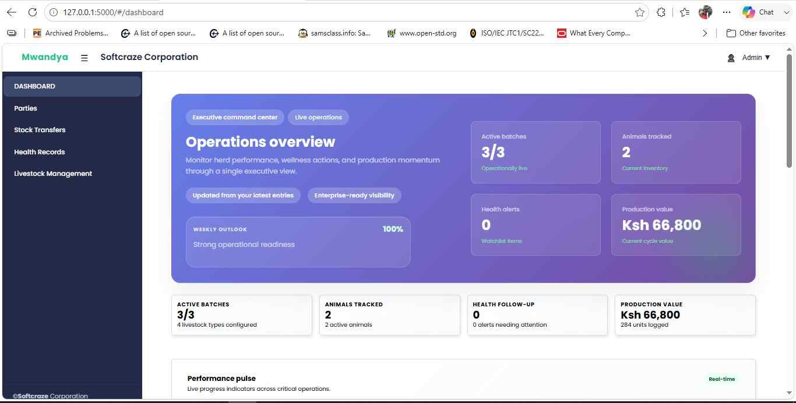
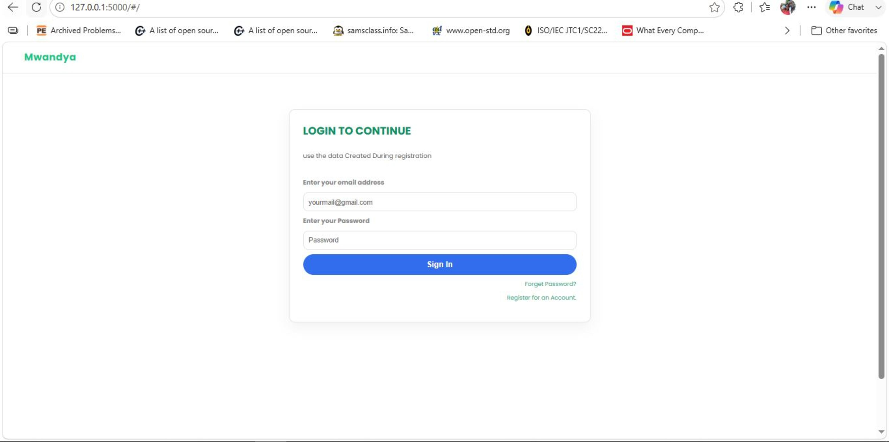
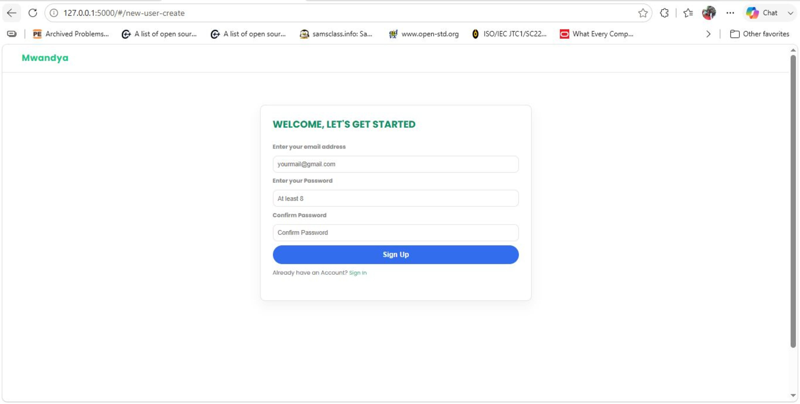
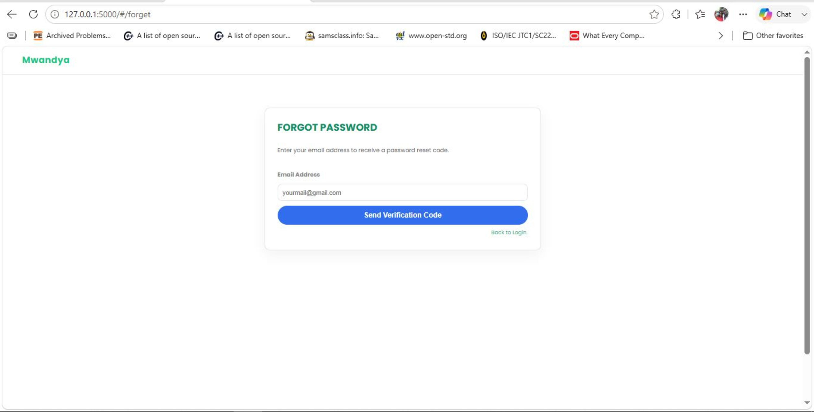
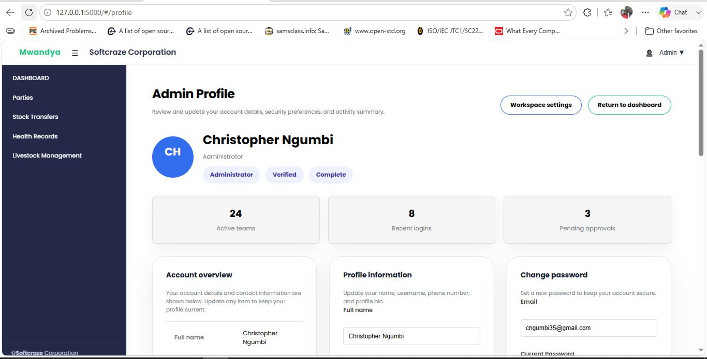
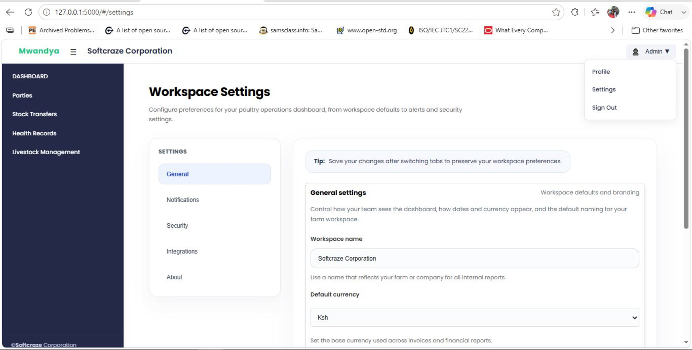

# RabitDog Accounting & Livestock ERP

A full-stack small business platform combining accounting, sales, inventory, livestock management, and reporting features.

This repository includes a Node/Express backend with MongoDB data storage, and a Webpack-powered frontend application that supports everything from order processing to journal entry accounting.

---

## 🚀 Project Overview

RabitDog is designed to support a mixed business model with:
- Accounting and financial management
- Customer and party invoicing
- Bank/cashbook workflows
- Budget and expense tracking
- Livestock batches, animal health, feeding, and production records
- Product sales, purchases, transfers, and inventory

The current implementation includes a working journal entry subsystem with:
- Journal entry list view
- Create journal entry page
- Detail page for review and posting
- Account selection from existing chart of accounts

---

## 🧱 Architecture

### Backend
- Node.js + Express
- MongoDB via Mongoose
- Session-based authentication with `express-session` and `connect-mongo`
- API routes for accounting, parties, products, orders, livestock, expenses, and uploads

### Frontend
- Plain JavaScript components
- Webpack build and development pipeline
- Axios for API communication
- Hash-based routing with a single-page app layout

---

## 📁 Repository Structure

- `backend/` — server code, routes, models, middleware, utilities
- `frontend/` — UI application source, components, assets, build config
- `uploads/` — static file storage for uploaded files
- `ACCOUNTING_ENGINE_README.md`, `LIVESTOCK_INTEGRATION_GUIDE.md` — domain documentation

---

## ✅ Features

### Accounting
- Chart of Accounts management
- Journal entry creation, balancing, and posting
- Invoice creation, editing, sending, and payment recording
- Budget setup and financial reporting
- Bank account and cashbook handling

### Journal Entry Flow
- `#/journal-entries` — list and filter entries
- `#/journal-entries/create` — create balanced journal entries
- `#/journal-entries/:id` — view entry details and post drafts
- Account selection with inline assignment to line items

### Livestock Management
- Batches, animals, health records, feeding, and production tracking

---

## 🛠️ Installation

### Prerequisites
- Node.js v20.x (recommended)
- npm v10.x
- MongoDB instance

### Environment
Create a `.env` file in `backend/` with values like:

```env
MONGODB_URL=mongodb://localhost:27017/rabitdog
PORT=5000
SESSION_SECRET=your_session_secret
JWT_SECRET=your_jwt_secret
REFRESH_TOKEN_SECRET=your_refresh_secret
PAYPAL_CLIENT_ID=your_paypal_client_id
NODE_CODE_EMAIL_ADDRESS=your_email@example.com
NODE_CODE_EMAIL_PASSWORD=your_email_password
NODE_EMAIL_SENDING_SERVICE=smtp
```

### Install dependencies

```bash
cd rabitDog
npm install
cd frontend
npm install
```

---

## ▶️ Running the App

### Development backend

```bash
npm run start
```

### Build frontend

```bash
cd frontend
npm run build:prod
```

### Full deploy build

```bash
npm run build
```

This generates frontend assets in `frontend/dist`, which the backend serves automatically.

---

## 🧭 Usage

### Access pages
- `/#/dashboard`
- `/#/invoices`
- `/#/journal-entries`
- `/#/journal-entries/create`
- `/#/journal-entries/:id`
- `/#/cashbank`
- `/#/budget`
- `/#/financial-reports`

### Journal entry creation
1. Open `#/journal-entries/create`
2. Enter description, entry type, and reference number
3. Add line items and assign accounts
4. Make sure debit and credit totals balance
5. Submit to create a draft entry
6. Post the draft from the details view or list

---

## 📷 Screenshots


### Dashboard



### Login



### Sign Up



### Forget password



### Profile



### Settings



---

## 🧪 Scripts

From the project root:
- `npm run start` — run backend in development with `nodemon`
- `npm run build` — compile backend and frontend for production
- `npm run build:prod` — build frontend production assets
- `npm run qstart` — install both backend and frontend dependencies

From `frontend/`:
- `npm start` — start Webpack dev server
- `npm run build:prod` — build production assets

---

## 📝 Notes

- The backend serves static frontend build files from `frontend/dist`
- API routes are mounted under `/api`
- The accounting system includes journal entry posting logic and account balance updates
- Configure `.env` before starting the server

---

## 📌 Contribution

If you want to extend the project, focus on:
- improved frontend routing and component reuse
- better validation and user feedback in forms
- responsive mobile UI support
